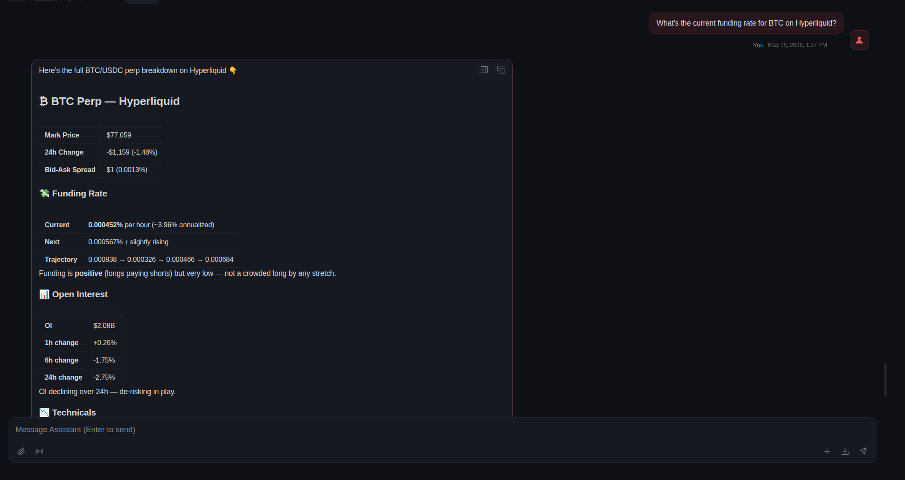
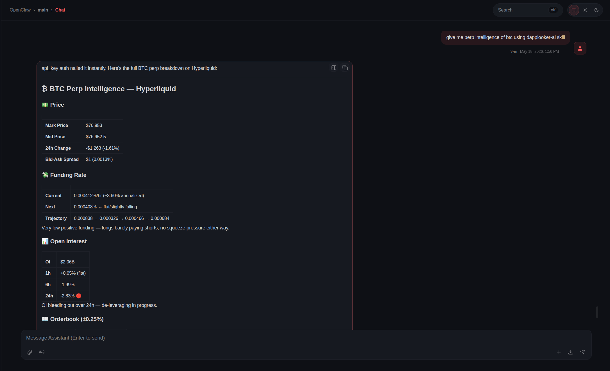
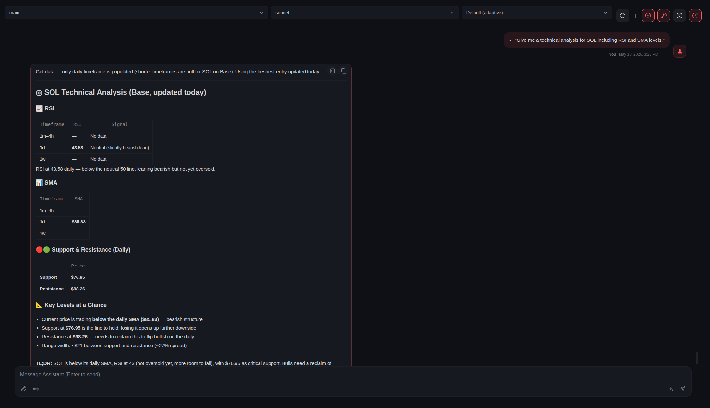
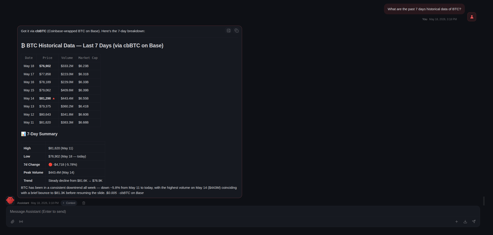

# DappLooker DeFi Intelligence for OpenClaw

Install these skills in [OpenClaw](https://openclaw.ai) to give your AI agent access to DappLooker's production-grade DeFi intelligence via x402 micropayments.

## What is DappLooker?

DappLooker is a DeFi intelligence suite providing real-time token metrics, perpetual market data across 10+ DEXs, multi-interval technical analysis, and AI-powered market research. These skills let any OpenClaw-compatible agent access DappLooker's capabilities through pay-per-use x402 payments.

**Official Website:** [docs.dapplooker.com](https://docs.dapplooker.com)

## What this Skill Adds

Your agent will be able to autonomously answer questions like:
- "What's the current funding rate for BTC on Hyperliquid?"
  
- "Give me perp intelligence of btc using dapplooker-ai skill."
  
- "Give me a technical analysis for AIXBT including RSI and SMA levels."
  
- "What are the past 7 days historical data for BTC?"
  

## Installation

### Method 1: ClawHub (Recommended)
If you have the OpenClaw CLI, simply run:
```bash
openclaw skills install dapplooker-ai
```

### Method 2: Manual Installation (GitHub URL)

#### Via terminal (CLI)
```bash
# 1. Create the skill directory
mkdir -p ~/.openclaw/skills/dapplooker-ai

# 2. Download the SKILL.md into that directory
curl -L https://raw.githubusercontent.com/dapplooker/openclaw-skills/main/dapplooker-intel/SKILL.md -o ~/.openclaw/skills/dapplooker-ai/SKILL.md

# 3. Verify it's ready
openclaw skills list | grep dapplooker
```

#### Via OpenClaw UI
1. Go to your OpenClaw dashboard
2. Navigate to **Skills** > **Add Skill**
3. Paste the raw GitHub URL:
   ```
   https://raw.githubusercontent.com/dapplooker/openclaw-skills/main/dapplooker-intel/SKILL.md
   ```

## Configuration

DappLooker endpoints utilize **x402 micropayments**, meaning your agent pays a tiny amount of USDC ($0.005 - $0.50) per request automatically.

For a full breakdown of costs per query, see [API_PRICING.md](API_PRICING.md).

### 1. Requirements
- A wallet funded with **USDC** on the **Polygon** network.
- Polygon (MATIC) for gas fees.

### 2. Set your Private Key
Configure your environment or `.env` file with the private key of your funded Polygon wallet:

```bash
export X402_PRIVATE_KEY=your_private_key_here
```

## How it Works
1. **Request:** Your agent asks DappLooker for data.
2. **Payment:** OpenClaw automatically settles the x402 payment using your configured wallet.
3. **Data:** Your agent receives the real-time DeFi intelligence and answers your question.

---

## Support
- **Full API Documentation:** [DappLooker Docs](https://docs.dapplooker.com/products/api-endpoints)
- **Twitter:** [@dapplooker](https://twitter.com/dapplooker)
- **GitHub:** [dapplooker/openclaw-skills](https://github.com/dapplooker/openclaw-skills)

## License
MIT License
